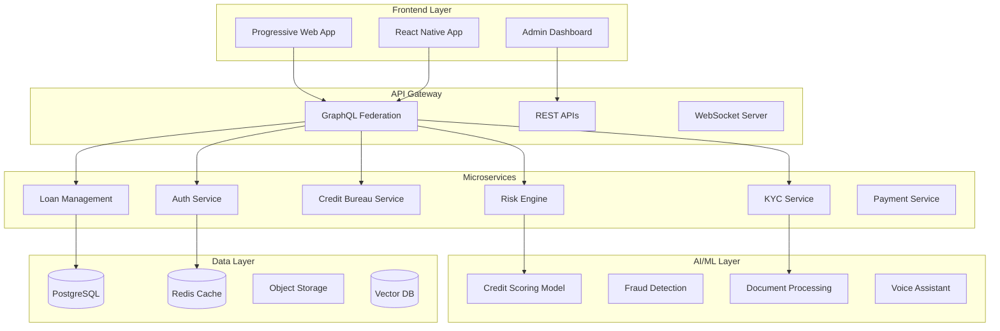

# Quikkred Architecture Documentation

## System Architecture

## Microservices Architecture

### 1. Authentication Service
- JWT-based authentication
- Biometric authentication
- OTP verification
- Session management

### 2. KYC Service
- Document upload and verification
- Aadhaar/PAN verification
- Video KYC
- CKYC integration

### 3. Credit Bureau Service
- CIBIL integration
- Experian integration
- CRIF integration
- Bureau data caching

### 4. Risk Engine
- Real-time scoring
- Fraud detection
- Policy engine
- Decision automation

### 5. Loan Management
- Application processing
- Underwriting
- Disbursement
- Collections

### 6. Payment Service
- UPI integration
- IMPS/NEFT
- Auto-debit
- Settlement

## AI/ML Pipeline

### Credit Scoring Model
- Feature engineering from 500+ variables
- XGBoost + Neural Network ensemble
- Real-time inference (<50ms)
- Continuous learning

### Fraud Detection
- Behavioral biometrics
- Device fingerprinting
- Graph analysis
- Anomaly detection

### Document Processing
- OCR with 99.9% accuracy
- Auto-classification
- Data extraction
- Validation

## Security Architecture

### Zero-Trust Security Model
1. **Network Security**
   - VPC isolation
   - Private subnets
   - WAF protection
   - DDoS mitigation

2. **Application Security**
   - OWASP compliance
   - Input validation
   - SQL injection prevention
   - XSS protection

3. **Data Security**
   - AES-256 encryption at rest
   - TLS 1.3 in transit
   - Field-level encryption for PII
   - Key rotation

4. **Access Control**
   - RBAC implementation
   - MFA enforcement
   - API rate limiting
   - Audit logging

## Performance Metrics

| Component | Target | Current |
|-----------|--------|---------|
| API Response Time | <100ms | - |
| KYC Completion | <90s | - |
| Credit Decision | <30s | - |
| Page Load Time | <1s | - |
| Uptime | 99.99% | - |

## Scalability Design

### Horizontal Scaling
- Kubernetes orchestration
- Auto-scaling policies
- Load balancing
- Circuit breakers

### Database Optimization
- Read replicas
- Connection pooling
- Query optimization
- Partitioning

### Caching Strategy
- Redis for sessions
- CDN for static assets
- API response caching
- Database query caching

## Monitoring & Observability

### Metrics Collection
- Prometheus + Grafana
- Custom dashboards
- Alert rules
- SLA monitoring

### Distributed Tracing
- OpenTelemetry
- Request correlation
- Performance bottlenecks
- Error tracking

### Logging
- ELK Stack
- Structured logging
- Log aggregation
- Real-time analysis